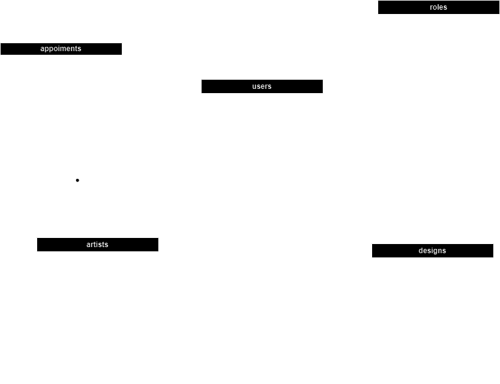

# Welcome to my backend app

<details>
  <summary>Contenido 📝</summary>
  <ol>
    <li><a href="#objetivo">Objetivo</a></li>
    <li><a href="#sobre-el-proyecto">Sobre el proyecto</a></li>
    <li><a href="#deploy-🚀">Deploy</a></li>
    <li><a href="#stack">Stack</a></li>
    <li><a href="#diagrama-bd">Diagrama</a></li>
    <li><a href="#instalación-en-local">Instalación</a></li>
    <li><a href="#endpoints">Endpoints</a></li>
    <li><a href="#futuras-funcionalidades">Futuras funcionalidades</a></li>
    <li><a href="#contribuciones">Contribuciones</a></li>
    <li><a href="#licencia">Licencia</a></li>
    <li><a href="#webgrafia">Webgrafia</a></li>
    <li><a href="#desarrollo">Desarrollo</a></li>
    <li><a href="#agradecimientos">Agradecimientos</a></li>
    <li><a href="#contacto">Contacto</a></li>
  </ol>
</details>

## Objetivo
Este proyecto requería una API funcional conectada a una base de datos con al menos una relación de uno a muchos y una relación de muchos a muchos.

## Sobre el proyecto
Decidí crear una aplicación web para ayudar a los amantes del gimnasio, que les permitiría crear y realizar un seguimiento de nuevas rutinas para sus ejercicios diarios. He visto muchas apps de este estilo pero ninguna que nos permita cambiar tan libremente las rutinas adaptandolas a nuestras necesidades.    

## Deploy 🚀
<div align="center">
    <a href="https://www.google.com"><strong>Url a producción </strong></a>🚀🚀🚀
</div>

## Stack
Tecnologías utilizadas:
[](https://developer.mozilla.org/en-US/docs/Web/JavaScript) [](https://developer.mozilla.org/en-US/docs/Web/API/Node) [](https://expressjs.com/) [](https://dev.mysql.com/doc/) [](https://jwt.io/introduction) [](https://developer.mozilla.org/en-US/docs/Glossary/Git)


## Diagrama BD


## Instalación en local
1. Clonar el repositorio
2. ` $ npm install `
3. Conectamos nuestro repositorio con la base de datos 
4. ``` $ Ejecutamos las migraciones ``` 
5. ``` $ Ejecutamos los seeders ``` 
6. ``` $ npm run dev ``` 
7. ...

## Endpoints
<details>
<summary>Endpoints</summary>

- AUTH
    - REGISTER

            POST http://localhost:3000/api/register
        body:
        ``` js
            {
                "user": "David",
                "email": "david@david.com",
                "password": "princes"
            }
        ```

    - LOGIN

            POST http://localhost:3000/api/login  
        body:
        ``` js
            {
                "user": "David",
                "email": "david@david.com",
                "password": "princes"
            }
        ```
- RUTINAS
    - RECUPERAR RUTINAS  

            GET http://localhost:3000/api/rutina

    - ...
</details>

## Futuras funcionalidades
[ ] Añadir create book  
[ ] Añadir logs  con winston  
[ ] Validaciones de la solicitud con express-validator  
[ ] ...

## Contribuciones
Las sugerencias y aportaciones son siempre bienvenidas.  

Puedes hacerlo de dos maneras:

1. Abriendo una issue
2. Crea un fork del repositorio
    - Crea una nueva rama  
        ```
        $ git checkout -b feature/nombreUsuario-mejora
        ```
    - Haz un commit con tus cambios 
        ```
        $ git commit -m 'feat: mejora X cosa'
        ```
    - Haz push a la rama 
        ```
        $ git push origin feature/nombreUsuario-mejora
        ```
    - Abre una solicitud de Pull Request

## Licencia
Este proyecto se encuentra bajo licencia de "Mi Nombre"

## Webgrafia:
Para conseguir mi objetivo he recopilado información de:
- link a repositorios 
- link a documentacion de librerias externas
- ...

## Desarrollo:

``` js
 const developer = "datata";

 console.log("Desarrollado por: " + datata);
```  

## Agradecimientos:

Agradezco a mis compañeros el tiempo dedicado a este proyecto:

- **Gabe**  
<a href="https://github.com/Dave86dev" target="_blank"></a> 

- **David**  
<a href="https://www.github.com/userGithub/" target="_blank"></a>

- ***Mara***  
<a href="https://www.github.com/userGithub/" target="_blank"></a> 

## Contacto
<a href = "mailto:micorreoelectronico@gmail.com"></a>
<a href="https://www.linkedin.com/in/linkedinUser/" target="_blank"></a> 
</p>