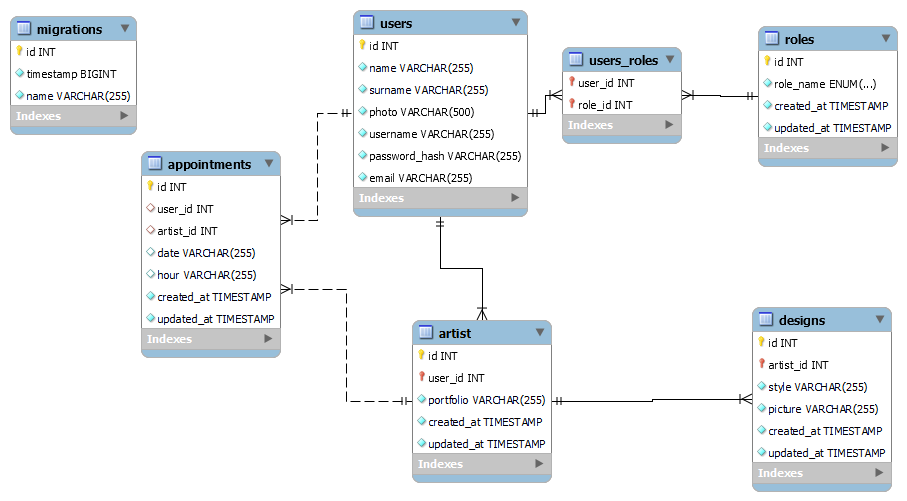

# TATOOSHOPP API

<details>
  <summary>Contenido 📝</summary>
  <ol>
    <li><a href="#objetivo">Objetivo</a></li>
    <li><a href="#sobre-el-proyecto">Sobre el proyecto</a></li>
    <li><a href="#stack">Stack</a></li>
    <li><a href="#diagrama-bd">Diagrama</a></li>
    <li><a href="#instalación-en-local">Instalación</a></li>
    <li><a href="#endpoints">Endpoints</a></li>
    <li><a href="#contribuciones">Contribuciones</a></li>
    <li><a href="#webgrafia">Webgrafia</a></li>
    <li><a href="#agradecimientos">Agradecimientos</a></li>
    <li><a href="#contacto">Contacto</a></li>
  </ol>
</details>

## Objetivo
Este proyecto requería una API funcional conectada a una base de datos relacional.

## Sobre el proyecto
Propuesto el proyecto de desarrollar una aplicación web para la gestión de una compañía de un estudio de tatuajes, el presente repositorio supone la sección backend del mismo. Esta sección habrá de desarrollarse con un esquema modelo vista controllador, generando una API funcional que permita hacer distintas llamadas, en ocasiones multitabla, discriminando los privilegios de usuario en función de su rol.


## Stack
Tecnologías utilizadas:
[](https://developer.mozilla.org/en-US/docs/Web/JavaScript) [](https://developer.mozilla.org/en-US/docs/Web/API/Node) [](https://expressjs.com/) [](https://dev.mysql.com/doc/) [](https://jwt.io/introduction) [](https://developer.mozilla.org/en-US/docs/Glossary/Git)


## Diagrama BD


## Instalación en local
1. Clonar el repositorio
2. ` $ npm install `
3. Conectamos nuestro repositorio con la base de datos 
4. ``` $ Ejecutamos las migraciones ``` 
5. ``` $ Ejecutamos los seeders ``` 
6. ``` $ npm run dev ``` 
7. ...

## Endpoints
<details>
<summary>Endpoints</summary>

- AUTH
    - REGISTER

            POST http://localhost:3000/auth/register
        body:
        
            {
                "username": "DavZZ",
                "name": "David",
                "surname": "Rodri",
                "email": "david@example.com",
                "password": "123456"
            }
        

    - LOGIN

            POST http://localhost:3000/auth/login 
        body:
        
            {
                "email": "david@example.com",
                "password": "123456"
            }
        

- USERS

    - Crear User

            POST http://localhost:3000/api/users
            
        body:
       
     
           {
            "username": "UserClient",
            "name": "UserClie",
            "surname": "Cuser",
            "password_hash": "123456",
            "email": "cuser@example.com"
            }

    
    -  Obtener todos los usuarios (super_admin)
    
            GET http://localhost:3000/api/users

    
    - Get user by id 
    
            GET http://localhost:3000/api/users/:id

            
    - Update user info 
    
            PATCH http://localhost:3000/api/users/:id
        body: 
          
                
                {
                "username" : "Cambio333UsiarioPrueba",
                "name": "Cam33UsiarioPr",
                "surname": "USUCita",
                "password_hash": "123456",
                "email" : "Priue@example.com"
                 }
                    
            

            
- ARTISTAS
    
    -Crear tatuador
        
      POST http://localhost:3000/api/artist
      
    body:  
        
    
            {
                "username" : "UserArtis",
                "name": "UserAr",
                "surname": "Auser",
                "password_hash": "123456",
                "email" : "auser@example.com"
            }

    -Ver tatuador por id
        
        GET http://localhost:3000/api/artist/16

    -Perfil del tatuador (con id)

        GET http://localhost:3000/api/artist/artistprofile/17
        
    -Ver todos los tatuadores(super_admin)
    
        GET http://localhost:3000/api/artist
          
          
           

- CITAS

    -Crear Cita

            POST http://localhost:3000/api/appointment
            
    body:
      
            
            {
                "user_id": 9,
                "artist_id": 7,
                "date": "2024-04-12",
                "hour": "13:00h"
            }
            
    -Ver todas las citas (super_admin)
        
            GET http://localhost:3000/api/appointment
            
    -Actualizar citas (con id)
    
            PATCH http://localhost:3000/api/appointment/1
      
    -Borrar cita (con id de cita)
    
            DELETE http://localhost:3000/api/appointment/1
            
    
        
</details>

## Contribuciones
Las sugerencias y aportaciones son siempre bienvenidas.  

Puedes hacerlo de dos maneras:

1. Abriendo una issue
2. Crea un fork del repositorio
    - Crea una nueva rama  
        ```
        $ git checkout -b feature/nombreUsuario-mejora
        ```
    - Haz un commit con tus cambios 
        ```
        $ git commit -m 'feat: mejora X cosa'
        ```
    - Haz push a la rama 
        ```
        $ git push origin feature/nombreUsuario-mejora
        ```
    - Abre una solicitud de Pull Request


## Webgrafia:
Para conseguir mi objetivo he recopilado información de:
- https://github.com/fidelfsd/fsd-online-express-typeorm-academy-api 
- https://github.com/vincenzo2202/Backend_tatto-studio_API_DB
- https://typeorm.io/


## Agradecimientos:

Agradezco a mis compañeros el tiempo dedicado a este proyecto y a los profesores de [GeeksHubsAcademy_](https://geekshubsacademy.com/) que nos han guiado en el camino 🤗:

- **Gabe**  
<a href="https://github.com/GabrielEscudillo" target="_blank"></a> 

- **Reynaldo**  
<a href="https://github.com/ReynaldoMunozF" target="_blank"></a>

- **Hector**  
<a href="https://www.github.com/userGithub/" target="_blank"></a> 

## Contacto
<a href = "mailto:om.erikaorlando@gmail.com"></a>
<a href="https://www.linkedin.com/in/erika-orlando/" target="_blank"></a> 
</p>